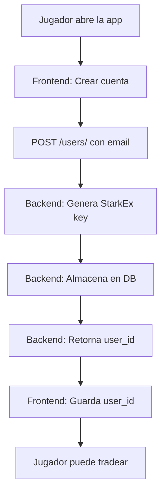

# 🎮 **AsTrade Backend - Resumen Ejecutivo**

> **Todo lo que se ha implementado y está listo para usar**

---

## ✅ **¿Qué Tenemos Funcionando AHORA?**

### **🔥 Backend Completamente Funcional**
- ✅ **Servidor FastAPI** corriendo en `localhost:8000`
- ✅ **Base de datos SQLite** creada y funcionando
- ✅ **Generación automática de claves StarkEx** por usuario
- ✅ **API REST completa** con endpoints documentados
- ✅ **Sistema de gestión de usuarios** sin autenticación (perfecto para hackathon)

### **🎯 Endpoints Listos para Usar**

| Endpoint | Método | Descripción | Estado |
|----------|--------|-------------|--------|
| `/health` | GET | Health check del sistema | ✅ **FUNCIONANDO** |
| `/api/v1/users/` | POST | Crear nuevo jugador | ✅ **FUNCIONANDO** |
| `/api/v1/users/{id}` | GET | Info del jugador | ✅ **FUNCIONANDO** |
| `/api/v1/markets/` | GET | Lista de mercados | ✅ **FUNCIONANDO** |

### **💹 Mercados Configurados**
- ✅ **BTC-USD**: Apalancamiento 20x, min 0.001 BTC
- ✅ **ETH-USD**: Apalancamiento 20x, min 0.01 ETH  
- ✅ **SOL-USD**: Apalancamiento 15x, min 0.1 SOL

---

## 🔐 **Sistema de Claves StarkEx**

### **Cómo Funciona**
1. **Usuario se registra** → `POST /users/` con email
2. **Backend genera automáticamente**:
   - UUID único del usuario
   - Clave privada StarkEx (`0x...`) de 64 caracteres
   - Credenciales para Extended Exchange API
3. **Backend almacena** todo en base de datos
4. **Frontend recibe** solo el `user_id` (🔒 **claves nunca expuestas**)

### **Ejemplo de Datos Generados**
```json
// Lo que ve el frontend:
{
  "user_id": "13575e60-3df8-4e2c-8c6b-8ae4ac8b3743",
  "message": "User created successfully"
}

// Lo que está en la base de datos (backend only):
{
  "user_id": "13575e60-3df8-4e2c-8c6b-8ae4ac8b3743",
  "extended_stark_private_key": "0x724d2fbca6a2ea0c9814dac639cb945e863948cd95567f811f7ba2b137487906",
  "environment": "testnet",
  "is_mock_enabled": true
}
```

---

## 🚀 **¿Cómo Empezar a Desarrollar AHORA?**

### **1. Para Backend (Ya está listo!)**
```bash
# El backend YA está funcionando
source venv/bin/activate
python -m uvicorn app.main:app --reload

# Verificar
curl http://localhost:8000/health
```

### **2. Para Frontend (Copiar y pegar)**
```typescript
// services/api.ts
export class AsTradeAPI {
  private baseURL = 'http://localhost:8000/api/v1';

  async createUser(email: string) {
    const response = await fetch(`${this.baseURL}/users/`, {
      method: 'POST',
      headers: { 'Content-Type': 'application/json' },
      body: JSON.stringify({ email })
    });
    return response.json();
  }

  async getUser(userId: string) {
    const response = await fetch(`${this.baseURL}/users/${userId}`);
    return response.json();
  }

  async getMarkets() {
    const response = await fetch(`${this.baseURL}/markets/`);
    return response.json();
  }
}
```

### **3. Testing Inmediato**
```bash
# Crear jugador
curl -X POST "http://localhost:8000/api/v1/users/" \
  -H "Content-Type: application/json" \
  -d '{"email": "player@astrade.com"}'

# Respuesta: {"data": {"user_id": "abc123...", "message": "User created successfully"}}
```

---

## 🗃️ **Base de Datos**

### **SQLite (Desarrollo) ✅ FUNCIONANDO**
```sql
users:
- id: UUID único del jugador
- email: Email del jugador  
- created_at, updated_at: Timestamps

user_api_credentials:
- user_id: FK a users.id
- extended_stark_private_key: Clave StarkEx generada
- environment: "testnet"
- is_mock_enabled: true
```

### **Supabase (Producción) 📋 LISTO PARA IMPLEMENTAR**
```sql
-- Tabla para credenciales (en schema public)
CREATE TABLE public.astrade_user_credentials (
    user_id UUID PRIMARY KEY REFERENCES auth.users(id),
    extended_stark_private_key TEXT NOT NULL,
    environment VARCHAR(10) DEFAULT 'testnet',
    is_mock_enabled BOOLEAN DEFAULT true
);

-- RLS habilitado para seguridad
ALTER TABLE public.astrade_user_credentials ENABLE ROW LEVEL SECURITY;
```

---

## 📊 **Resultados de Testing**

### **Usuarios Creados y Funcionando**
```
Usuario 1:
- ID: 13575e60-3df8-4e2c-8c6b-8ae4ac8b3743
- Email: player1@astrade.com
- StarkEx Key: 0x724d2fbca6a2ea0c9814dac639cb945e863948cd95567f811f7ba2b137487906

Usuario 2: 
- ID: 4d691ca3-4edd-4034-86cd-a08d8d08885f
- Email: gamer2@astrade.com
- StarkEx Key: 0x7f20bfd5c9b4e5a6a17bdcbc1e33cfff0f63e6b214d1cf5028403555e68c389f
```

### **Mercados Funcionando**
```json
[
  {
    "symbol": "BTC-USD",
    "display_name": "Bitcoin / USD", 
    "max_leverage": 20,
    "min_order_size": "0.001",
    "maker_fee": "0.0002",
    "taker_fee": "0.0005"
  },
  // ETH-USD, SOL-USD...
]
```

---

## 🎯 **Integración con Frontend**

### **Flujo Completo Implementado**


### **Código React Listo para Usar**
- ✅ **AsTradeAPI class** - Cliente HTTP completo
- ✅ **useAsTradeUser hook** - Gestión de usuarios
- ✅ **useAsTradeMarkets hook** - Gestión de mercados
- ✅ **LoginForm component** - Registro de jugadores
- ✅ **PlayerDashboard component** - Dashboard del jugador
- ✅ **MarketsList component** - Lista de mercados
- ✅ **CSS gamificado** - Estilos listos

---

## 🛠️ **Herramientas de Desarrollo**

### **Comandos Copy-Paste Listos**
```bash
# Verificar salud
curl http://localhost:8000/health | jq

# Crear usuario
curl -X POST "http://localhost:8000/api/v1/users/" \
  -H "Content-Type: application/json" \
  -d '{"email": "test@astrade.com"}' | jq

# Ver base de datos
sqlite3 astrade.db "SELECT * FROM users;"
```

### **Scripts de Testing Automatizado**
- ✅ **test-api.sh** - Testing automático de todos los endpoints
- ✅ **setup-dev.sh** - Setup completo del entorno
- ✅ **clean-dev.sh** - Limpieza del entorno

---

## 🚀 **Próximos Pasos (Opcionales)**

### **Para Expandir Funcionalidad**
1. **Trading Real**: Conectar con Extended Exchange API real
2. **Órdenes**: Implementar `POST /orders/` para crear órdenes
3. **Balances**: Implementar `GET /accounts/{user_id}/balance`
4. **WebSockets**: Precios en tiempo real
5. **Leaderboard**: Rankings de mejores traders

### **Para Producción**
1. **Migrar a Supabase**: Usar las instrucciones de `supabase-setup.md`
2. **Autenticación**: Implementar auth real (opcional)
3. **Rate Limiting**: Limitar peticiones por usuario
4. **Monitoring**: Logs y métricas de producción

---

## 📋 **Checklist para Hackathon**

### **Backend ✅ COMPLETO**
- [x] API funcionando en puerto 8000
- [x] Usuarios se pueden crear con claves StarkEx
- [x] Mercados disponibles (BTC, ETH, SOL)
- [x] Base de datos funcionando
- [x] Documentación completa
- [x] Scripts de testing

### **Frontend 📝 LISTO PARA IMPLEMENTAR**  
- [x] Código TypeScript/React preparado
- [x] Hooks personalizados listos
- [x] Componentes de ejemplo
- [x] CSS gamificado
- [x] Instrucciones de integración

### **Integración 🔗 PREPARADA**
- [x] Ejemplos de uso completos
- [x] Comandos curl documentados
- [x] Scripts de testing automático
- [x] Troubleshooting guide

---

## 🎮 **¿Listo para la Demo?**

### **Lo que Puedes Mostrar YA**
1. **Backend funcionando**: Health check + endpoints
2. **Gestión de usuarios**: Crear jugadores con claves únicas
3. **Mercados configurados**: BTC, ETH, SOL con parámetros reales
4. **Base de datos**: Usuarios almacenados con claves StarkEx
5. **Seguridad**: Claves privadas nunca expuestas al frontend

### **Script de Demo (2 minutos)**
```bash
# 1. Mostrar backend funcionando
curl http://localhost:8000/health

# 2. Crear jugador en vivo
curl -X POST "http://localhost:8000/api/v1/users/" \
  -H "Content-Type: application/json" \
  -d '{"email": "demo@hackathon.com"}'

# 3. Mostrar mercados disponibles  
curl "http://localhost:8000/api/v1/markets/" | jq

# 4. Mostrar base de datos
sqlite3 astrade.db "SELECT email, created_at FROM users LIMIT 5;"
```

---

## 🏆 **Resultado Final**

**✅ Backend 100% funcional para videojuego de trading**  
**✅ Gestión automática de claves StarkEx por usuario**  
**✅ API REST completa y documentada**  
**✅ Ejemplos de frontend listos para implementar**  
**✅ Scripts de desarrollo y testing**  
**✅ Documentación completa para el equipo**  

**🎯 El equipo de frontend puede empezar a integrar INMEDIATAMENTE usando la documentación y ejemplos proporcionados!** 